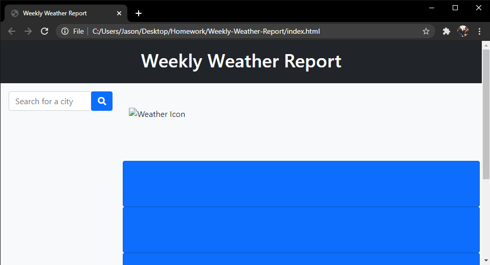

# Weekly-Weather-Report

## Description

This is a simple weather dashboard that you can use to track current and future weather conditions. When finished, it will display a given city with the current date, temperature, humidity, wind speed, UV Index, and an icon representing weather conditions. There will also be five cards that display the weather conditions, temperature, and humidity for the five following days. 

https://github.com/twohunters/Weekly-Weather-Report

https://twohunters.github.io/Weekly-Weather-Report

## Installation

Type the following into your terminal to copy this repository:

`git clone git@github.com:twohunters/Weekly-Weather-Report.git`

For further instructions, visit https://help.github.com.

## Usage

Enter the desired city name in the search box on the left of the page and the weather conditions will appear to the right. A list of previous searches will appear in a container below the search box.

## Credits

https://github.com/twohunters

https://momentjs.com/

https://jquery.com/

https://getbootstrap.com/

https://fontawesome.com/

## License

This is free and unencumbered software released into the public domain.

Anyone is free to copy, modify, publish, use, compile, sell, or distribute this software, either in source code form or as a compiled binary, for any purpose, commercial or non-commercial, and by any means.

In jurisdictions that recognize copyright laws, the author or authors of this software dedicate any and all copyright interest in the software to the public domain. We make this dedication for the benefit of the public at large and to the detriment of our heirs and successors. We intend this dedication to be an overt act of relinquishment in perpetuity of all present and future rights to this software under copyright law.

THE SOFTWARE IS PROVIDED "AS IS", WITHOUT WARRANTY OF ANY KIND, EXPRESS OR IMPLIED, INCLUDING BUT NOT LIMITED TO THE WARRANTIES OF MERCHANTABILITY, FITNESS FOR A PARTICULAR PURPOSE AND NONINFRINGEMENT. IN NO EVENT SHALL THE AUTHORS BE LIABLE FOR ANY CLAIM, DAMAGES OR OTHER LIABILITY, WHETHER IN AN ACTION OF CONTRACT, TORT OR OTHERWISE, ARISING FROM, OUT OF OR IN CONNECTION WITH THE SOFTWARE OR THE USE OR OTHER DEALINGS IN THE SOFTWARE.

For more information, please refer to https://unlicense.org